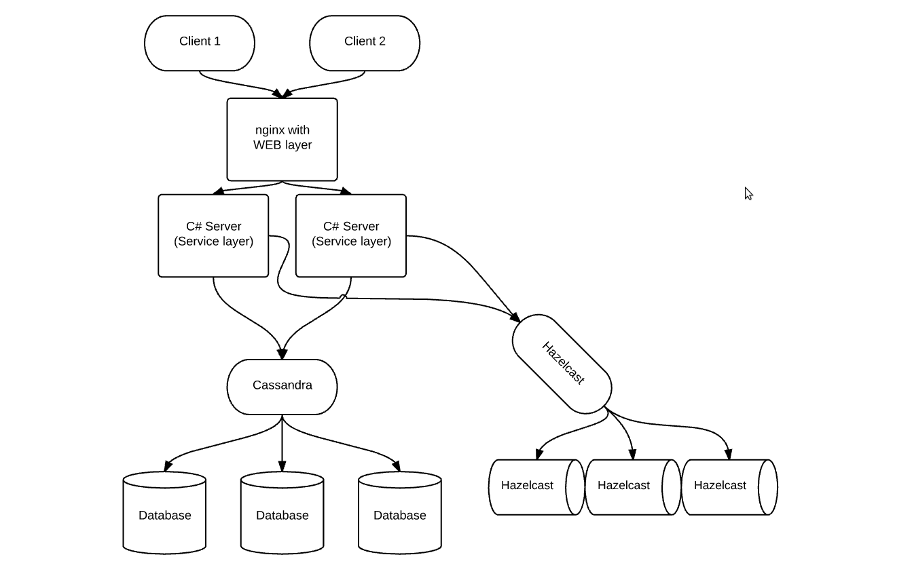

# animal-shelter

This is a distributed system which help you choose pets that you like.   
Architecture diagram of the system
  
  
    
### Before go forward, run all commands from ./main-server/src.

### Create alias for redirect recoures in a site. To do this add record "172.18.0.10 myhost" to /etc/hosts.  
`echo "172.18.0.10 myhost" | sudo tee -a /etc/hosts`  

### Start all services:  
`sudo docker-compose up -d`  

### Stop and remove:  
`sudo docker-compose down`
